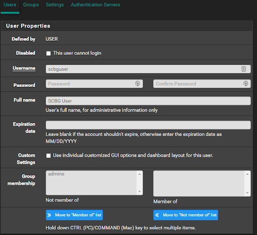

# PFSense Docs!

## Setup Remote Access VPN
Using OpenVPN

[Instructions from TurboFuture](https://turbofuture.com/computers/How-to-Setup-a-Remote-Access-VPN-Using-pfSense-and-OpenVPN)

## Create a VPN User
1. Log into PFSense web UI (Credentials are in KeePass)
   - https://99.174.223.246/ (at adam’s house)
   - 5 (local on the network)
2. In the menu, navigate to System > User Manager.
3. Click + Add.
4. Fill out the basics:
   - Username
   - Password
   - Full name
   - Expiration date (if necessary)
5. Do not add to any groups.
6. Click Save.
7. Send the human their credentials via secure means.

